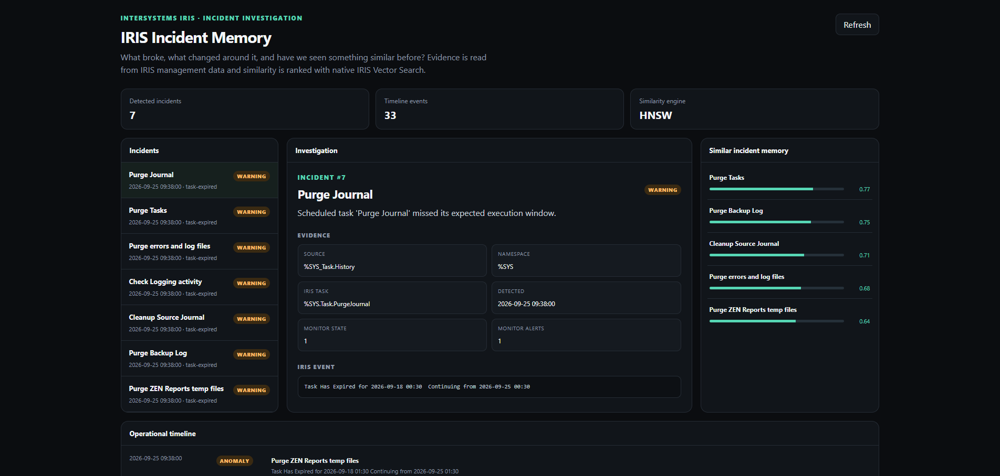

# IRIS Incident Memory

**Incident investigation for InterSystems IRIS.**

IRIS Incident Memory is a focused management portal that helps an operator answer three questions quickly:

> **What broke, what changed around it, and have we seen something similar before?**

Instead of presenting another broad administration dashboard, it builds an evidence-backed incident timeline from native IRIS management data and keeps a searchable memory of previous incidents.

Built for the **2026 InterSystems Programming Contest: Build Your Own Management Portal**.



## What it does

IRIS Incident Memory:

- reads scheduled-task history through the InterSystems SysAdmin API (`GET /api/admin/v2/task/history`)
- captures process context through the SysAdmin API (`GET /api/admin/v2/processes`)
- captures system-usage context through the SysAdmin API (`GET /api/admin/v2/monitor/system-usage`)
- separates operational anomalies from configuration/change events
- persists normalized incidents and timeline events in IRIS
- creates incident representations with Embedded Python
- stores those representations in a native IRIS `VECTOR(DOUBLE,128)` column
- creates an IRIS HNSW cosine index
- retrieves the most similar historical incidents for the selected incident
- exposes the result through an IRIS-hosted REST API and responsive web portal

The interface is deliberately evidence-first. Similarity results remain tied to the IRIS events that produced them rather than being presented as unsupported conclusions.

## Quick start

### Requirements

- Docker Desktop or Docker Engine with Docker Compose
- enough memory to run InterSystems IRIS Community Edition
- x86-64 or another platform supported by the selected IRIS container

Clone the repository:

```bash
git clone https://github.com/martynas816/iris-incident-memory.git
cd iris-incident-memory
```

Start the application:

```bash
docker compose up --build
```

Then open:

```text
http://localhost:52773/incident-memory/
```

The first clean startup can take around a minute. The bootstrap waits for IRIS Task Manager history to become available before the initial incident scan.

No manual class import, Management Portal configuration, SQL grant, or initialization command is required.

Stop the application with:

```bash
docker compose down
```

## What happens on startup

The container automatically:

1. starts InterSystems IRIS
2. imports and compiles the `IncidentMemory` classes
3. waits for Task Manager history to become available
4. calls the native InterSystems SysAdmin API and ingests its management evidence
5. persists incidents and timeline events
6. builds the native IRIS vector similarity index
7. creates the application role and least-privilege SQL grants
8. configures the `/incident-memory` IRIS web application
9. serves the portal and REST API

A clean-container validation produced:

```text
IMPORT STATUS: 1
TASK HISTORY READY: 1
new_incidents: 7
new_changes: 26
indexed: 7
ROLE STATUS: 1
WEB APP STATUS: 1
SQL GRANT STATUS: 1
```

The resulting API returned 25 incidents and the portal returned HTTP 200. Counts depend on the management history available in the IRIS instance. Counts depend on the management history of the IRIS instance and are not hard-coded application data.

## Architecture

```text
InterSystems SysAdmin API
        |
        +-- /api/admin/v2/task/history
        +-- /api/admin/v2/processes
        +-- /api/admin/v2/monitor/system-usage
        |
        v
SysAdminClient
        |
        v
IncidentDetector
        |
        +--> Incident persistent objects
        +--> TimelineEvent persistent objects
        |
        v
Embedded Python TextVectorizer
        |
        v
VECTOR(DOUBLE,128)
        |
        v
IRIS HNSW index + VECTOR_COSINE
        |
        v
SimilarityIndex
        |
        v
REST API
        |
        v
Incident investigation portal
```

## Incident classification

Task Manager history contains more than failures. IRIS Incident Memory distinguishes:

- successful task executions
- task configuration/change records
- expired scheduled tasks
- other abnormal task results

Only anomaly records become incidents. Configuration records remain timeline context.

This avoids treating every non-empty Task Manager history field as an error.

## Incident representation

The contest build intentionally uses a lightweight deterministic representation rather than an external machine-learning service.

`IncidentMemory.TextVectorizer` runs as Embedded Python and:

- normalizes incident text
- creates unigram and adjacent-bigram features
- feature-hashes them into 128 dimensions
- applies signed hashing
- L2-normalizes the resulting vector

The representation is persisted and searched with **native InterSystems IRIS Vector Search**.

This means the application has no external model API, model download, or network dependency for similarity retrieval.

## Native IRIS technologies used

### InterSystems SysAdmin API

The incident-ingestion path is powered by the InterSystems SysAdmin API.

On clean startup, the local contest container creates a temporary `%Operator` service account, uses HTTP Basic authentication to call the native IRIS SysAdmin endpoints, ingests the returned management evidence, and then removes that temporary account.

The application uses:

- `GET /api/admin/v2/task/history`
- `GET /api/admin/v2/processes`
- `GET /api/admin/v2/monitor/system-usage`

Task-history responses drive incident detection and timeline creation. Process and system-usage responses are stored as investigation context alongside each detected incident.

The contest build was validated against InterSystems IRIS Community Edition 2026.2 (Build 221U), whose installed SysAdmin API reports API version 2.
### Persistent data

`IncidentMemory.Incident` stores detected incidents.

`IncidentMemory.TimelineEvent` stores anomaly and change events used by the operational timeline.

### Embedded Python

Embedded Python is used for management-data processing, normalization, incident representation, and JSON/API assembly.

### Vector Search

Incident vectors are stored as:

```sql
VECTOR(DOUBLE,128)
```

The application creates an HNSW index using cosine distance and ranks similar incidents using `VECTOR_COSINE`.

### IRIS REST application

`IncidentMemory.REST` extends `%CSP.REST` and serves both the API and the web application.

Main endpoints:

```text
GET /incident-memory/
GET /incident-memory/health
GET /incident-memory/api/overview
GET /incident-memory/api/overview/:incidentId
```

## Project structure

```text
Dockerfile
compose.yaml
entrypoint.sh
iris.script

src/IncidentMemory/
  API.cls
  Incident.cls
  IncidentDetector.cls
  SysAdminClient.cls
  ManagementSnapshot.cls
  REST.cls
  SimilarityIndex.cls
  StartupGate.cls
  TextVectorizer.cls
  TimelineEvent.cls

web/
  index.html
```

## Security model

The contest container exposes the incident portal without a login for straightforward local evaluation.

The web application receives only:

- `%DB_USER`
- the custom `IncidentMemoryReader` role

`IncidentMemoryReader` is granted read access only to the application tables required by the portal.

The supplied configuration is intended for a local contest/demo environment. Do not expose the unauthenticated development container directly to an untrusted network.

## Reproducibility

The application was validated from a completely fresh container using **InterSystems IRIS Community Edition 2026.2 (Build 221U)**.

The clean test required no interactive IRIS configuration after the container was started.

`compose.yaml` restricts the container to 20 CPUs because of the IRIS Community Edition core limit.

## Community Opportunity

Related InterSystems Ideas Community Opportunity:

**AI analysis of error logs**  
https://ideas.intersystems.com/ideas/DPI-I-574

IRIS Incident Memory applies that operational-investigation goal to IRIS management/task-history evidence by turning abnormal events into persistent, comparable incidents with historical retrieval.

The current implementation does **not** send operational data to an external LLM. Its incident representation is generated locally with Embedded Python and searched natively inside IRIS.

## Why this is different

Many management portals answer:

> What is the system doing right now?

IRIS Incident Memory focuses on a different operational workflow:

> Something went wrong. What evidence surrounds it, what changed nearby, and what previous incident looks most like this one?

The aim is not to replace the full InterSystems Management Portal. It is to make one investigation workflow much faster and easier to reason about.

## Contest

**InterSystems Programming Contest: Build Your Own Management Portal**

https://openexchange.intersystems.com/contest/48

## License

MIT
